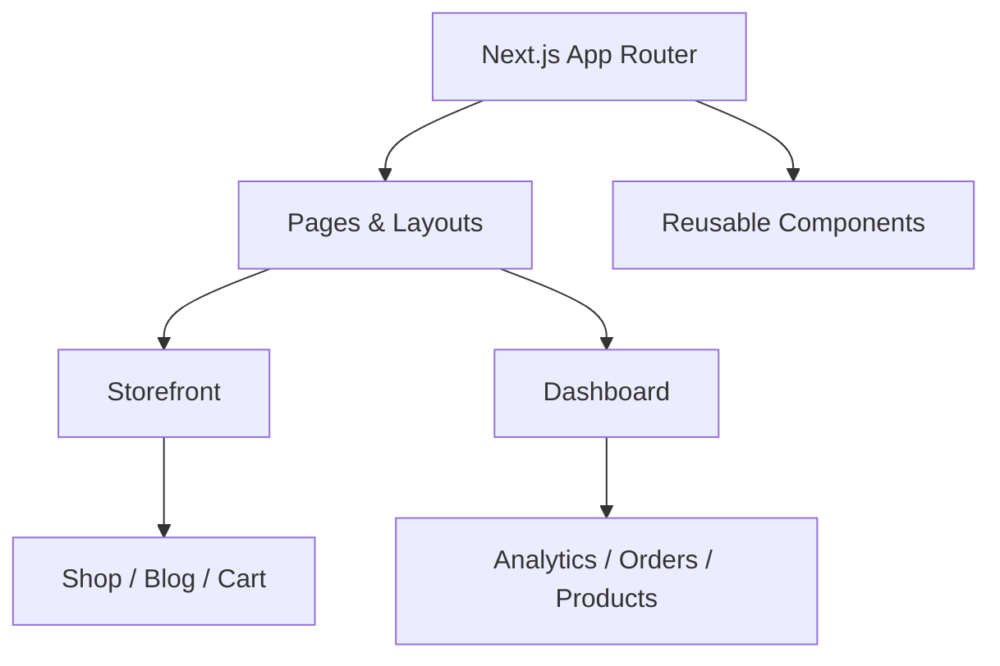

<p align="center">
  
</p>

<h1 align="center">🛍️ E-Commerce Next.js</h1>

<p align="center">
  Modern Next.js 16 e-commerce frontend with dashboard, storefront & UI experiments
</p>

<div align="center">

<a href="#">
  
</a>
<a href="LICENSE">
  
</a>
<a href="#">
  
</a>

</div>

---

<div align="center">
✨ Modern UI • ⚡ Fast • 🧩 Modular • 📊 Dashboard Ready
</div>

---

## ⚠️ Important Disclaimer

> This project is built for **educational and personal use only**.

- ❌ Not intended for production or commercial use  
- ❌ No guarantee of compliance (payments, auth, legal, etc.)  
- ⚠️ Use at your own risk  

👉 If you want to build a real product:
- Add backend APIs  
- Implement authentication  
- Integrate payments  
- Ensure legal compliance  

---

## 🌟 Features

| Feature | Description |
|--------|------------|
| 🏠 **Modern Storefront** | Multiple home layouts and responsive UI |
| 🛒 **E-Commerce Flow** | Cart, checkout, wishlist, compare |
| 📦 **Product Pages** | Dynamic routes like `/shop/[slug]` |
| 📰 **Blog System** | Blog listing and detail pages |
| 👤 **User Pages** | Account, auth-style UI |
| 📊 **Admin Dashboard** | Orders, products, analytics, charts |
| 📈 **Charts & Tables** | ApexCharts + data tables |
| 🎨 **UI Components** | Reusable components with Bootstrap & MUI |

---

## 🏗️ Project Architecture



---

## 🧰 Tech Stack

<div align="center">

### 🚀 Frontend


### 🎨 UI & Styling


### 📊 Libraries & Tools


<br/>


</div>

---

## 📁 Folder Structure

```
ecommerce-nextjs/
├── public/                 # Static assets
├── public-dashboard/       # Dashboard assets
├── src/
│   ├── app/                # App Router
│   │   ├── (demos)/        # Home variations
│   │   ├── (inner)/        # Shop, blog, etc.
│   │   └── dashboard/      # Admin pages
│   └── components/         # Reusable components
├── next.config.ts
├── package.json
└── tsconfig.json
```

---

## 🚀 Getting Started

### 📌 Prerequisites
- Node.js 20+
- npm / yarn / pnpm

---

### 🔧 Installation

```bash
git clone <your-repo-url>
cd ecommerce-nextjs
npm install
```

---

### ▶️ Run Development Server

```bash
npm run dev
```

Visit 👉 http://localhost:3000

---

## 📜 Scripts

| Command | Description |
|--------|------------|
| `npm run dev` | Start dev server |
| `npm run build` | Production build |
| `npm run start` | Run production |
| `npm run lint` | Run ESLint |

---

## 🎯 Learning Goals

This project helps you understand:

- ✅ Next.js App Router  
- ✅ Component architecture  
- ✅ State management patterns  
- ✅ UI composition  
- ✅ Dashboard design  

```

---

## 🧠 Future Improvements

- 🔐 Authentication (JWT / OAuth)
- 💳 Payment integration (Stripe)
- 🌐 Backend APIs
- 🧪 Testing (Jest / Playwright)
- 🚀 Deployment (Vercel)

---

## 🤝 Contributing

```bash
git checkout -b feature/your-feature
git commit -m "Added new feature"
git push origin feature/your-feature
```

Open a Pull Request 🚀

---

## 📜 License

This project is for **educational purposes only**.

---

## 🙌 Acknowledgments

- Next.js Team  
- Open-source community  
- UI libraries used in this project  

---

<div align="center">

⭐ Star this repo if you like it!

</div>
